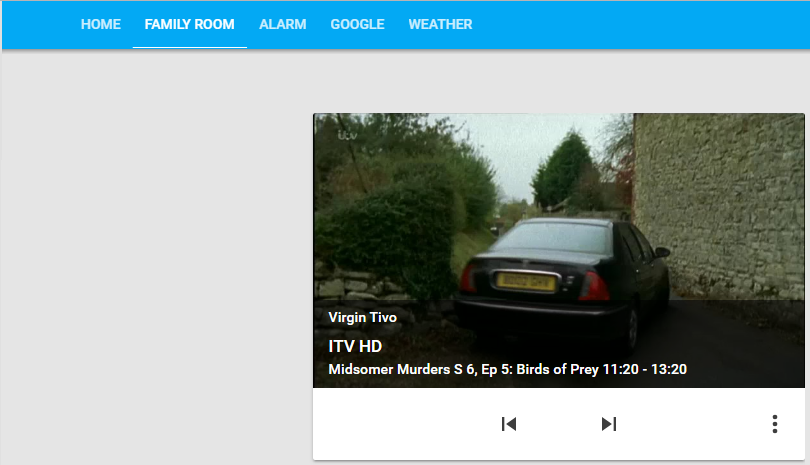
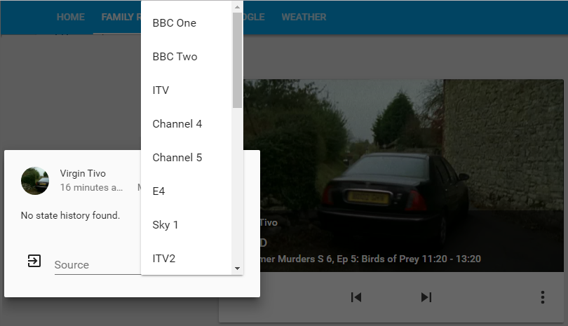

# Home Assistant VirginTivo
Home Assistant component for control of Virgin Media Tivo boxes




Features are

+ Supports multiple boxes
+ Configurable list of channels
+ Automatically switch to HD version of channel
+ Show current channel
+ Set channel through dropdown
+ Can restrict channels shown in dropdown
+ Switch between +1 and normal version of channel
+ Depending on whether the channel is available on Virgin Go
  + Display programme information
  + Display grab of current programme
+ Optionally use Tivo remote to control other media player devices (obscure I know!)

A sample configuration is in the repository with a full list of Virgin Media channels.

# Usage
+ Drop the file into the custom_components/media_player directory.
+ Edit your configuration file to add the `virgintivo` platform.

# Configuration
There are two required sections: tivos and channels, plus one optional section: guide.

Platform settings are:

| Name | Default | Description | Example |
|:---- |:-------:|:------------|:--------|
| platform _(req)_ | | Must be virgintivo | virgintivo |
| default_is_show _(opt)_ | true | Channels default to shown/hidden | true |
| force_hd _(opt)_ | false | Switch to HD if available | false |

**NB:** if using the _force_hd_ functionality, it is advisable to set _scan_interval_ to a low value, e.g. 1 to allow the component to change to the HD channel quickly.

## tivos
The Tivos should be listed under the `tivos:` section.  Each entry has two required settings and one optional.

| Name | Default | Description | Example |
|:-----|:--------|:------------|:--------|
| name _(req)_ | | Friendy name of Tivo box | Virgin Tivo |
| host _(req)_ | | IP or name of Tivo box | TIVO-C68000012345678 |
| force_hd _(opt)_ | false | Switch to HD if available | false |

## channels
Channels come under the `channels:` section.  Each entry has a number of optional settings and one required setting (name).  Use next/previous track to switch between the +1 and normal versions of a channel.

| Name | Default | Description | Example |
|:-----|:--------|:------------|:--------|
| name _(req)_ | | Friendy name of channel | BBC One |
| show _(opt)_ | | Show the channel in the sources list | false |
| hd_channel _(opt)_ | | HD channel number if applicable | 108 |
| plusone _(opt)_ | | +1 channel number if applicable | 114 |
| logo _(opt)_ | | Channel logo to display | http://freeview.com/images/e4.png |
| target _(opt)_ | | HA entity to change | media_player.main_tv |
| source _(req)_ | | Source on _target_ to choose | HDMI2 |

## guide
The guide settings come under the `guide:` section.  This section has a number of optional settings.

| Name | Default | Description | Example |
|:-----|:--------|:------------|:--------|
| enable_guide _(opt)_ | true | Enable the guide functionality | false |
| cache_hours _(opt)_ | 12 | How many hours of the guide to preload | 12 |
| picture_refresh _(opt)_ | 60 | Seconds between screen updates | 60 |

# Example

```
  - platform: virgintivo
    default_is_show: false
    force_hd: true
    tivos:
      1:
        name: Virgin V6
        host: TIVO-C68000012345678
      2:
        name: Virgin Tivo
        host: TIVO-CF0000012345678
    channels:
      100:
        name: Virgin Media Previews
      101:
        name: BBC One
        hd_channel: 108
        show: true
      102:
        name: BBC Two
        hd_channel: 162
        show: true
      103:
        name: ITV
        hd_channel: 113
        show: true
        plusone: 114
      104:
        name: Channel 4
        hd_channel: 141
        plusone: 142
      105:
        name: Channel 5
        hd_channel: 150
        plusone: 155
```
